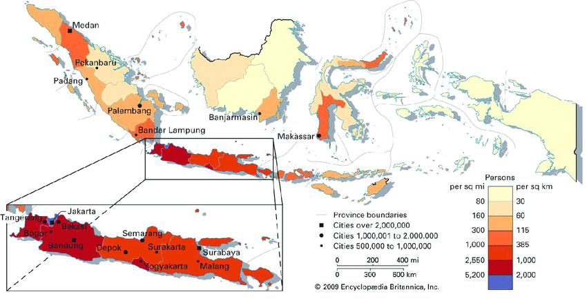
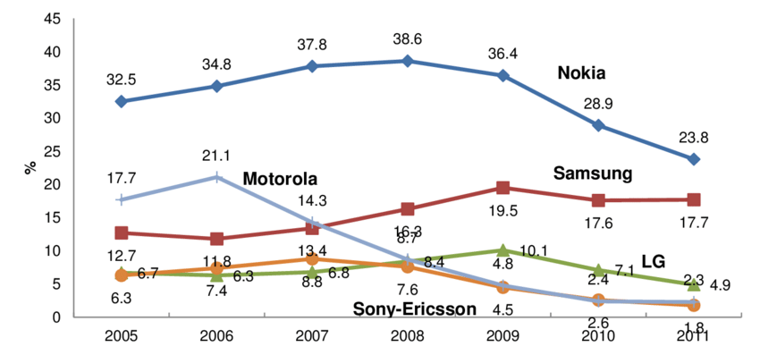
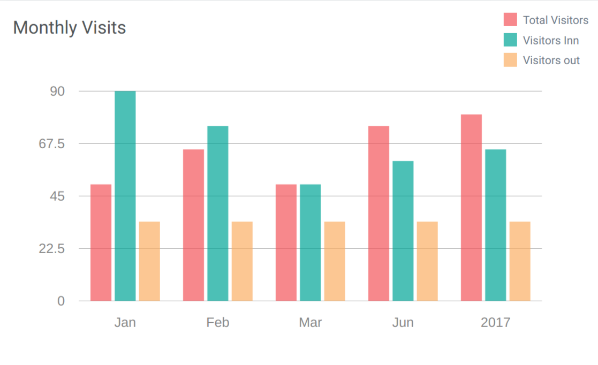

# Pertemuan_14
## Changelog
View at [Homepage](https://github.com/ricky03knowhere/IF214002#pertemuan-14)
- ✅ CREATE : Mengerjakan Tugas

## Tugas
1. Sebagai pemimpin organisasi / perusahaan, dari data hasil aplikasi yang sudah dibuat, tentukan masalah-masalah prioritas untuk dicari solusinya !

2. Tentukan struktur data dan bentuk visualisasinya ! Ada contoh visualisasinya (screenshot)

3. Buat query SQL untuk mendapatkan data no. 2 tersebut !

## Jawab
1. Daftar Masalah-masalah prioritas
    - Ingin tahu wilayah / kota dengan pengunjung terbanyak
    - Ingin tahu Agregat pemasukan penjualan tiket perbulan
    - Ingin tahu Agregat objek wisata terfavorit (pengunjung terbanyak)
    - Ingin tahu Agregat jumlah pengunjung perhari
    - Ingin tahu Agregat jumlah tiket terjual perbulan

2. Struktur data & bentuk visualisasinya
    - Mencari wilayah / kota dengan pengunjung terbanyak
      - Visualisasi : Map chart
      - Data : kode_pos, jumlah pengunjung, bulan,

        
    - Agregat pemasukan penjualan tiket perbulan
      - Visualisasi : Line chart
      - Data : total harga tiket, total harga tiket / bulan, bulan, tahun
        
        
    - Agregat objek wisata terfavorit (pengunjung terbanyak)
      - Visualisasi : Bump chart
      - Data : jenis tiket, tiket terjual, bulan, tahun
        
        
    - Agregat jumlah pengunjung perhari
      - Visualisasi : Calendar chart
      - Data : tiket terjual, hari,  bulan, tahun
        
        
    - Agregat jumlah jenis tiket terjual perbulan
      - Visualisasi : Bar chart
      - Data : jenis tiket, tiket terjual,  bulan, tahun
        
        


3. Query SQL
    - Mencari wilayah / kota dengan pengunjung terbanyak
      ```sql
      SELECT pk.pos_kode_id, pk.provinsi, count(*) AS pengunjung FROM users u
      JOIN pos_kodes pk ON u.pos_kode_id = pk.id
      GROUP BY pk.pos_kode_id, pk.provinsi;
      ```

    - Agregat pemasukan penjualan tiket perminggu
      ```sql
      SELECT date_part('week'::text, p.tanggal_pesan) AS week, sum(p.total_harga) AS total FROM pemesanans p
      GROUP BY (date_part('week'::text, p.tanggal_pesan))
      ORDER BY (date_part('week'::text, p.tanggal_pesan)); 
      ```

    - Agregat objek wisata terfavorit (pengunjung terbanyak)
      ```sql
      SELECT obj.objek_wisata_id, ow.nama, obj.week, sum(obj.pengunjung) AS sum FROM ( 
        SELECT tw.objek_wisata_id, sales.week, sales.jenis_tiket_id, sales.jumlah_tiket_sold AS pengunjung FROM (
          SELECT date_part('week'::text, dp.tanggal_wisata) AS week, t.jenis_tiket_id, count(dp.tiket_id) AS jenis_tiket_sold, sum(dp.jumlah_tiket) AS jumlah_tiket_sold FROM detail_pemesanans dp
          JOIN tikets t ON t.id = dp.tiket_id
          GROUP BY (date_part('week'::text, dp.tanggal_wisata)), t.jenis_tiket_id
          ORDER BY (date_part('week'::text, dp.tanggal_wisata))) sales
        JOIN tiket_wisatas tw ON sales.jenis_tiket_id = tw.jenis_tiket_id
        ORDER BY sales.week, tw.objek_wisata_id) obj
      JOIN objek_wisatas ow ON ow.id = obj.objek_wisata_id
      GROUP BY obj.objek_wisata_id, obj.week, ow.nama
      ORDER BY obj.objek_wisata_id, obj.week;
      ```

    - Agregat jumlah pengunjung perhari
      ```sql
      SELECT date_trunc('day'::text, dp.tanggal_wisata) AS date, count(dp.jumlah_tiket) AS pengunjung FROM detail_pemesanans dp
      GROUP BY (date_trunc('day'::text, dp.tanggal_wisata))
      ORDER BY (date_trunc('day'::text, dp.tanggal_wisata));
      ```
    - Agregat jumlah tiket terjual perminggu
      ```sql
      SELECT date_part('week'::text, dp.tanggal_wisata) AS week, t.jenis_tiket_id,count(dp.tiket_id) AS jenis_tiket_sold, 
      sum(dp.jumlah_tiket) AS jumlah_tiket_sold FROM detail_pemesanans dp
      JOIN tikets t ON t.id = dp.tiket_id
      GROUP BY (date_part('week'::text, dp.tanggal_wisata)), t.jenis_tiket_id
      ORDER BY (date_part('week'::text, dp.tanggal_wisata));
        ```