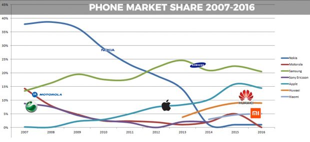

# Quiz Pertemuan 7
## Soal
1) Berikan contoh pemanfaatan data historis
2) Rancang ERD untuk penyimpanan data karyawan dari sebuah perusahaan, lengkap dengan data historis gaji, data historis tempat tinggal, dan data historis jabatan. Selanjutnya, implementasikan ERD tersebut pada basis data relasional (MySQL / PostgreSQL / SQL Server / dll) menggunakan perintah

## Jawaban
### 1) Contoh pemanfaatan data historis

- Contoh di atas adalah data histori penjualan smartphone dari berbagai brand dari tahun 2007 - 2016

### 2)  Studi kasus karyawan
#### Rancangan ERD


#### Implementasi Mysql

```sql

CREATE TABLE 'karyawan' (
  'id_karyawan' int(3),
  'id_his_temp_tgl' int(3),
  'id_jabatan' int(3),
  'id_his_gaji' int(3),
  'nama_lengkap' varchar(128),
  'no_telp' varchar(12),
  'email' varchar(128),
  'tgl_lahir' date,
  'tgl_masuk' date
)

CREATE TABLE 'histori_gaji' (
  'id_his_gaji' int(2),
  'gaji_bulanan' int(24),
  'tanggal_mulai' date
) 

CREATE TABLE 'histori_jabatan' (
  'id_jabatan' int(2),
  'nama_jabatan' varchar(128),
  'jam_kerja' int(2),
  'ruangan' int(3)
) 

CREATE TABLE 'histori_tamp_tinggal' (
  'id_his_temp_tgl' int(2),
  'alamat' varchar(128),
  'kota' varchar(128),
  'provinsi' varchar(128)
) 

```